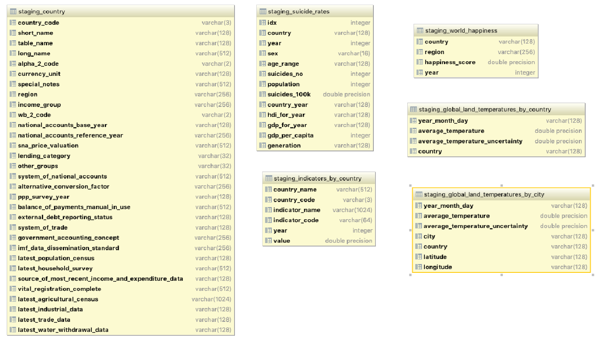
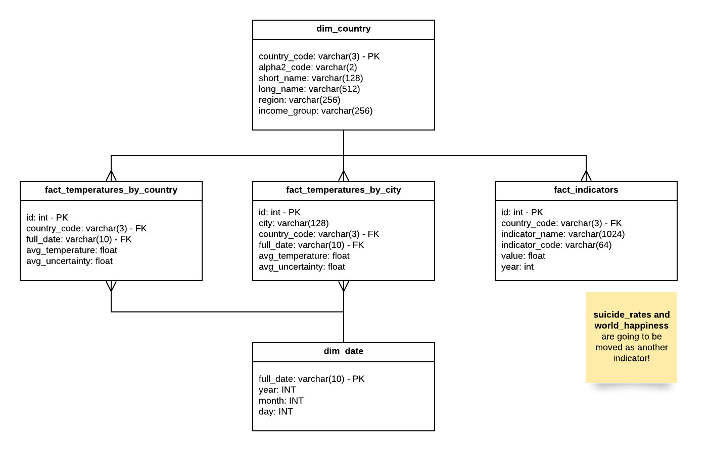
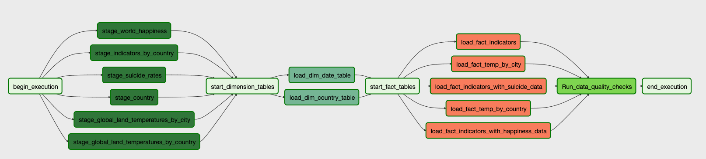

# Data Pipeline

The approach taken to create the Data Pipeline is explained in the following
sections:

1. Schema Design
2. Pipeline Design
3. Airflow Configuration (Redshift, S3 Credentials)
4. Pipeline Implementation

## Schema Design

At this moment, we have the following files in our S3 bucket:

- Country.csv
- GlobalLandTemperaturesByCity.csv
- GlobalLandTemperaturesByCountry.csv
- Indicators.csv
- suicide_rates.csv
- world-happiness-report.json

To move this raw data, a `staging` schema was created, as it is shown
in the following images:



Each table matches a file in the S3 bucket:

- Country.csv -> staging_country
- GlobalLandTemperaturesByCity.csv -> staging_global_land_temperatures_by_city  
- GlobalLandTemperaturesByCountry.csv -> staging_global_land_temperatures_by_country
- Indicators.csv -> staging_indicators
- suicide_rates.csv -> staging_suicide_rates
- world-happiness-report.json -> staging_world_happiness

Based on the contents of the `staging` schema, a definition for the
fact and dimension tables was created. This definition was done with the
following decisions in mind:

- The country and date are two concepts required to filter most information, therefore
`dim_country` and `dim_date` should be created.
- The temperatures by city and by date are two groups of related data, but
given that most likely they are going to be used in independent analysis,
they should be stored as separate tables.
- The suicide rates and world happiness report are concepts that can be included
as indicators. So they are going to be stored in the same table as the other indicators.

As a result, we got the following diagram:



## Pipeline Design

Based on the proposed design, before automating the whole pipeline process,
four scripts were coded. These scripts define the schema and implement the
whole process of taking the data from S3, moving it to staging tables in
Redshift (by using the `copy` command) and finally organizing the data into
fact and dimension tables. The four files are:

- `staging_create_schema.sql`: Defines the schema for the staging tables
- `pipeline_create_schema.sql`: Defines the schema for the fact and dimension
tables
- `staging_copy_data`: Copy commands to move the data from S3 to Redshift
- `pipeline_insert_data`: Insert commands to move the data from the staging
tables to the fact and dimension tables

## Airflow Configuration

As described in Step 3, Airflow was configured to run using `Docker`. To
start Airflow, go to the `3-iac` folder and execute the following command:

```bash
docker-compose up -d
```

The `docker-compose` file starts Airflow in port 18001. If you're running
this command locally, you can go to `http://localhost:18001` to open your
running instance.

To access Redshift and S3, we need to create credentials for both options.
To do this, do the following:

- Click the `Admin` tab.
- Click the `Connections` option.
- Create a connection named `redshift`, with all the information of your
AWS Redshift running instance.
- Create another connection named `aws_credentials`, with your AWS-KEY,
and AWS-SECRET, in the login and password fields.

## Pipeline Implementation

With the Docker configuration for Airflow, the files located in the `dag`
and `plugins` folders will be run by Airflow. In particular the following
files are important:

- `dags/create_tables_dag.py`: DAG definition to create staging, fact and
dimension tables.
- `dags/migrate_data_dag.py`: DAG definition to implement the whole data
migration process.
- `plugins/helpers/sql_queries.py`: SQL used to create the schema and to
insert data into the fact and dimension tables.
- `plugins/operators/stage_redshift.py`: Operator used to move data from
S3 to Redshift.
- `plugins/operators/load_dimension.py`: Operator used to load data into
a dimension table.
- `plugins/operators/load_fact.py`: Operator used to load data into a
fact table.
- `plugins/operators/data_quality.py`: Operator used to verify that the
data was properly loaded into the tables.

Out of these files, the most important one is `migrate_data_dag.py` which
is in charge of the pipeline process to move data to the fact and dimension
tables where analysis can be performed.



The process was conceived in four different stages:

1. Load data from S3 to staging tables.
2. Load data from staging tables to dimension tables.
3. Load data from staging and dimension tables to fact tables.
4. Verify that the data in fact and dimension tables was properly loaded.

To show that the data from the `suicide_rates` and `world_happiness_report` datasets
was also loaded to the `fact_indicators` table, specific tasks were created for that
part of the pipeline.
